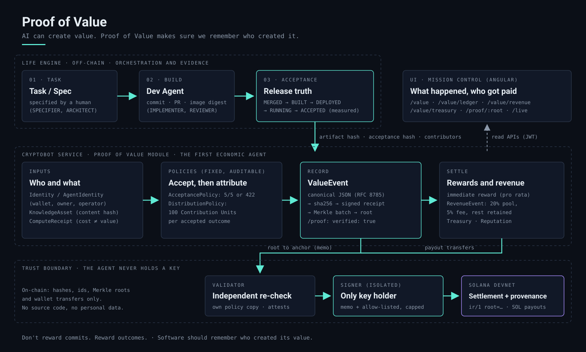

<!-- Product name: defined only in the title below; change it there. -->
# CryptoBot — Proof of Value for Autonomous Agents

<p align="center"></p>

**An autonomous agent plans, passes independent risk controls, executes on Solana, proves the accepted outcome,
attributes contributors and distributes value.**

<p align="center">
  
  <a href="https://life-engine.app/landing/cryptobot/"></a>
  <a href="#verify-it"></a>
</p>

Colosseum · Solana track · everything runs on **Solana devnet**, and every claim of "real" below links to a finalized
devnet transaction.

## How it works

```
Intent → Strategist → Guardian → Operator → Solana
       → AcceptanceProof → ValueEvent → Contribution Units → Reward / Reputation
```

CryptoBot plans a devnet operation, deterministic risk controls and an independent validator check it, an isolated
signer executes it, and the software behind it counts only once it is measured as accepted. That outcome becomes a
ValueEvent anchored on Solana, its contributors get Contribution Units, and each one is paid on-chain.

<details>
<summary><b>Each step — what happens and what proves it</b></summary>

| Step | What happens | Proven by |
|---|---|---|
| **Intent** | CryptoBot, an agent on Solana devnet, states what it wants: a rebalance of its SOL to its own vault. | the proposal and its audit trail |
| **Strategist** | A deterministic planner turns the intent into exact lamports; the exact transaction bytes are simulated first. No LLM sets an amount. | `SIMULATION` / `STRATEGY` receipts |
| **Guardian** | 13 named policy rules under a versioned, hashed policy (`R_v`, `H_R`) → ALLOW / ESCALATE / DENY. Above the autonomous limit the verdict escalates: timelock + approval. | `RISK_DECISION` receipt, re-run on verify |
| **Operator** | An approval, then an **independent validator** (separate process, own copy of the policy) re-derives the verdict, and an **isolated signer** signs only those bytes. The agent never holds a key. | Ed25519 attestation + `EXECUTION` receipt |
| **Solana** | The transaction is broadcast, finalized and reconciled against the chain. | [finalized devnet tx](https://explorer.solana.com/tx/5GEExMC7qDKaVcQYyA9ySVYuVQGLrkM2NbFoJQjwok6aANPD7iXtYWLtQLybXdJ1zVDLK4XqbFHXcu8zRotumfdB?cluster=devnet) |
| **AcceptanceProof** | The software the agent runs counts only after five **measured** stages: MERGED → BUILT → DEPLOYED → RUNNING → ACCEPTED. Fewer than five ⇒ `422`, nothing is recorded. | `acceptanceHash` inside the anchored event |
| **ValueEvent** | The accepted outcome becomes a signed receipt (canonical JSON, RFC 8785) whose Merkle root is written to Solana in a memo. | [anchor memo](https://explorer.solana.com/tx/njcczLuW6AsKsCq8zRge5chWKiQ3RiVo5oivm6i8AGmkG336h2FYyXraPoDuZBiEWu3M6aJWsuT4iyAWJGs4Zu3?cluster=devnet) · `GET /value-events/{id}/proof` → `verified: true` |
| **Contribution Units** | 100 units per accepted outcome, split equally per contribution: specifier, implementer agent, reviewer, compute node, and the creator of every knowledge asset used. | units ledger (always adds up) |
| **Reward / Reputation** | Each contributor is paid on Solana, one transfer per wallet; revenue (simulated in the demo, labelled) is shared 20 % contributors · 5 % fee · 75 % retained. Reputation is plain counts. | [payout](https://explorer.solana.com/tx/2pvNWzk6oraxjHUAPiJVyzLZQUJZW4DGx3nKJjTAc9tAmUtbZ8VfhwTFCRUVr8NqUHM4diBgA97WjCSTaE5AudEV?cluster=devnet) · [revenue anchor](https://explorer.solana.com/tx/4tPj6faSSgCpkJFkGtvgtNy6QmkcAGfVhdxRyCLyk9dEYYDxuhcFFjVtJHcSBJyBSdPg4BxzMZrJMR9oTU31YyQL?cluster=devnet) |

</details>

*Strategist, Guardian and Operator are the names of pipeline roles, not separate AI agents: the planner
(`RebalancePlanner`), the policy engine plus the independent validator, and the approval plus the isolated signer. In
the demo the approval is given by the script with the operator role.*

<a id="quickstart--the-demo-on-devnet"></a>

## Try it

Docker (Compose v2), bash, curl, python3 and git. No Life Engine service is needed: the demo stack brings its own
Postgres, validator, signer, service and UI.

```bash
git clone https://github.com/sebdev89/life-engine-cryptobot-service && git clone https://github.com/sebdev89/life-engine-cryptobot-ui cryptobot-ui
cd life-engine-cryptobot-service && scripts/demo/hackathon.sh --setup   # devnet keys + airdrop, demo stack + UI (first build: a few minutes)
scripts/demo/hackathon.sh                                               # preflight → the 9 steps on devnet → every tx checked on-chain
```

`hackathon.sh` aborts **before any SOL moves** if something is missing — the network is not devnet (genesis hash), the
wallet is short, a container is unhealthy, the running build is not this commit, an endpoint does not answer or the
database already used the task — and says how to fix it. `--check` runs only that preflight; `--no-operation` skips the
real operation (≈ 0.02 SOL instead of moving 21–40 % of the demo wallet to the demo's own vault). It ends with:

```
HACKATHON DEMO — PASS 9/9
Operation:        https://explorer.solana.com/tx/<signature>?cluster=devnet
ValueEvent:       <uuid>
AcceptanceProof:  https://explorer.solana.com/tx/<signature>?cluster=devnet
RevenueEvent:     https://explorer.solana.com/tx/<signature>?cluster=devnet
Proof:            verified=true
Report:           out/pov-e2e-<timestamp>.md
```

*AcceptanceProof* is the anchor of the ValueEvent: the five measured stages are hashed into it. On a fresh clone the
stages are **declared** for the demo task (printed in red); with a release-truth report (`--acceptance-json`) they are
measured. The devnet RPC airdrop is rate-limited; the web faucet is https://faucet.solana.com.

## Verify it

One run, 2026-10-03, all **finalized** on devnet without error (checked with `getSignatureStatuses`):

| What | Devnet transaction | What to look for |
|---|---|---|
| CryptoBot operation | [`5GEExMC7…otumfdB`](https://explorer.solana.com/tx/5GEExMC7qDKaVcQYyA9ySVYuVQGLrkM2NbFoJQjwok6aANPD7iXtYWLtQLybXdJ1zVDLK4XqbFHXcu8zRotumfdB?cluster=devnet) | slot 507129422 · `SystemProgram.transfer` of 1.467475780 SOL from the agent's wallet `G4bC…4exS` to its own vault `FrBN…6BmX` |
| ValueEvent anchor (AcceptanceProof inside) | [`njcczLuW…WJGs4Zu3`](https://explorer.solana.com/tx/njcczLuW6AsKsCq8zRge5chWKiQ3RiVo5oivm6i8AGmkG336h2FYyXraPoDuZBiEWu3M6aJWsuT4iyAWJGs4Zu3?cluster=devnet) | memo `ir/1 root=sha256:ddd2d2fb…4c279 n=1` — ValueEvent `bf29103b-9358-44e7-a3d9-bbd49fa22164`, receipt `sha256:f3379054…46bdaf` |
| RevenueEvent anchor | [`4tPj6faS…U31YyQL`](https://explorer.solana.com/tx/4tPj6faSSgCpkJFkGtvgtNy6QmkcAGfVhdxRyCLyk9dEYYDxuhcFFjVtJHcSBJyBSdPg4BxzMZrJMR9oTU31YyQL?cluster=devnet) | memo `ir/1 root=sha256:8e8a1e0b… n=14` — 0.05 SOL, **simulated** economic result, source: the operation above |

The proof, by hand, without our service — a batch of one receipt has `root = SHA-256(0x00 ‖ receiptHash)`:

```bash
printf '00f337905444c051b1f7f6cfea68022ef8fcd4a0bbe5865ffb20cdeb585046bdaf' | xxd -r -p | sha256sum
# ddd2d2fbc7da9394f654a512a4338203aadcbdd363b3242d9d1723fe750c4279  = the root in the memo of njcczLuW…
```

Larger batches and every other hash: [`docs/PROOF-OF-VALUE.md` → *Verifying a hash on-chain by hand*](docs/PROOF-OF-VALUE.md#verifying-a-hash-on-chain-by-hand).

<a id="what-is-real-today"></a>

## What's real

States: `MERGED → BUILT → DEPLOYED → RUNNING → ACCEPTED`. **ACCEPTED** here means: running on the devnet demo stack built
from `main`, with the transactions below finalized. V1–V4 and V6 were also measured 7/7 by release truth in the UAT
(Kubernetes) environment; V5, V7, V8 and V9 on the devnet demo stack. **V1–V9 are ACCEPTED. V10 is IN PROGRESS.**

| V | Capability | State | Devnet evidence |
|---|---|---|---|
| — | Trusted Agent Execution (policy, approval, timelock, validator, isolated signer, DLQ/retry, reconciliation, receipts) | **RUNNING** on devnet (demo 5/5 acts) | [execution](https://explorer.solana.com/tx/3ofZGCjbMXgjHY6iB8w7VSXvr6pHvajzayS7sSJox1yZxeDwPHAyb17xs8cXzUf7Us8GTbqc5M3tVUL85pGfewmh?cluster=devnet) · [recovered retry](https://explorer.solana.com/tx/65g1juW9qSPuM3jNacoq12QjMa1cVZv2DCCoybCw7vA74oBYZEpeqgwkZHRkDPv1g21iXQZLkd2Uu7xdp8K13WEq?cluster=devnet) · [Merkle anchor](https://explorer.solana.com/tx/4xBC6UTVghYajPwWQKLe1mdByKXahah2YFdQgiRQTArhvJkLMoshWmbZTLk4jwWaGuUXTLL8sQULeiJ53XSPPvjY?cluster=devnet) |
| V1 | Value Event Core — ValueEvent as a signed receipt, 5-stage acceptance policy, anchored root, `/proof` | **ACCEPTED** | [ValueEvent anchor](https://explorer.solana.com/tx/5wQz93E6rMjmDMjJMcAi7EKh3CH1xmFrWUs1dRZkYMn79vRRE7XogJA1BRnLrSmoQyfe45AXd8DSQn5ckP6HpqXB?cluster=devnet) |
| V2 | Agent Economic Identity — wallets, owner/operator, explicit reputation, history | **ACCEPTED** | same anchor · [later run](https://explorer.solana.com/tx/38NsA46oSxcvqDHwEmHG7z3Yz4Nu2xFzETbxgk3opqdBJDk6wRAonH1tJUKxDjGTxCsR3Nh4TdDGxirCUkqG5fbr?cluster=devnet) |
| V3 | Knowledge Provenance — assets by content hash, `usedIn`, creator credited | **ACCEPTED** | same anchors (assets are inside the anchored canonical event) |
| V4 | Compute Attribution — compute receipts kept separate from value | **ACCEPTED** | same anchors |
| V5 | Immediate Reward — pool of 0.01 SOL paid pro rata, one transfer per wallet | **ACCEPTED** | [distribution anchor](https://explorer.solana.com/tx/UyWfiX4NeJGveZu8YwY8HfkUEHakKrx9DEUgk5iRi1hBZkMpRK7Yxdju6Z37hyUTBS9rNLSKkqBWhpRJy3i1T1N?cluster=devnet) · [payout 0.004 SOL](https://explorer.solana.com/tx/4nGFvvoCbyxsqXFdgGiyzdknpkBWfHPzT46UMyTDkvXKho7fmnwYyhdUZmp1YwdC9WWrFubZbfKXqoCPxkSEdF4D?cluster=devnet) · [2nd distribution](https://explorer.solana.com/tx/5qzt7aiWNyvEHHkME4BTCwSumHKVQqDjadYsLHmy3aE5iLjZ84vPnhVNQCLZxjtbcE3oM2YspPFMQmd6xmosSTzo?cluster=devnet) · [payout](https://explorer.solana.com/tx/4ekXe4xDFLtQVDAT5WEkogtFgcBh1U477jPSoyZK4VZpYKAKLv9AAk1T6RXNVu1ZUZfHaNAqqBWWqW8NSVMWT5aW?cluster=devnet) |
| V6 | Contribution Units ledger by identity / asset / project | **ACCEPTED** | ledger totals = events × 100 (same anchors) |
| V7 | Revenue Event — revenue from a real CryptoBot proposal shared by historical units | **ACCEPTED** (amount is a *simulated economic result*, labelled) | [revenue anchor](https://explorer.solana.com/tx/gAu96iBK2WfANagw9t67uYhutaog9ej7k1nq2fjK58yeBkYQNHJ2X4Azu6aKiQVinuEMgDCQUBGXJtyui3bqefW?cluster=devnet) · [payout](https://explorer.solana.com/tx/2D6LUcAAbbadJ1W2hqGTGcDcrwVPam4YCtH481KycmNERgieaTjKfrsvvvezSgtwz9Jq3cWMVo7RsiLcgUHzfLjY?cluster=devnet) |
| V8 | Autonomous CryptoBot Economy — treasury read model of `cryptobot-001` | **ACCEPTED** (read model; every spend is a payout with policy, cap and receipt) | `GET /treasury/cryptobot-001`: income 0.05 SOL, payouts 0.03 SOL, fee 0.0025, retained 0.0375 |
| V9 | End-to-end: one command, nine steps, one report — **including a real CryptoBot operation** | **ACCEPTED** (9/9 steps, 2026-09-30, repeated 2026-10-03; the revenue amount is a *simulated economic result*, `simulated=true`, on top of a real operation) | [ValueEvent anchor](https://explorer.solana.com/tx/51nco1gL2wxNPT2Mi8T4PMSMwgxpPjSbae7djBrGZoYjyyWuRY4uc33aknjD514ixBhgXEwB1f2224PnoWjQCmKY?cluster=devnet) · [CryptoBot operation](https://explorer.solana.com/tx/xYpJkKrPa96jLbpJHEe5kBtNUVSKeiBdrDPThg4J8UfW9uTE4w5sE846tR5umc7qK3vM2AMcJ5FkUHvP73pBARF?cluster=devnet) · [RevenueEvent anchor](https://explorer.solana.com/tx/Bcq8cqYbUndGkzi74DtrmuZXGpLV1KQPd98k6SDXSjzjbVDBbFcx5XdbYiXp5gkLj7RVVe3NL2ofqdDqHNDJpT3?cluster=devnet) — all finalized on devnet |
| V10 | Hackathon product: README, diagram, golden path (`hackathon.sh`), landing, video, submission | **IN PROGRESS** | closes only with the evidence in the checklist below |

**What closes V10** — every item with its proof, none of them assumed:

- [ ] **Landing** — `https://life-engine.app/landing/cryptobot/` answers 200 `text/html` to a client without cookies, and its
      claims match this README.
- [ ] **Video** — the demo video is published, ≤ 3 min, and linked from the *Watch demo* button above (today a placeholder).
- [ ] **Submission** — sent on Colosseum before the deadline, with a capture of the confirmation.
- [ ] **Links** — every public link of this README, the landing and the submission checked without cookies on the day of
      the submission, and every explorer transaction `finalized` without error by `getSignatureStatuses`.
- [ ] **Golden path** — `scripts/demo/hackathon.sh` passes 9/9 on a clean stack built from `main`.

A row moves to ACCEPTED only with a finalized transaction produced by the image that is actually deployed. Known gap:
the OCI build label (`life-engine.commit`) of the image running in the UAT pod is still stale — the fix (labels stamped
at build time) is pull request #54 and reaches the pod with its next deploy, after the submission; the image itself is
identified by digest.

## Why Solana

- **Cheap enough to pay every contributor separately.** One anchor costs 0.000005 SOL; a whole 9-step run with 10
  transfers and 3 anchors costs 0.020055 SOL (measured without the operation, 2026-09-30 and again 2026-10-04). A payout
  per contributor, not a monthly batch.
- **Public, permanent, checkable by anyone.** A memo with a Merkle root is the whole on-chain footprint of a ValueEvent;
  any explorer or RPC can read it back and anyone can fold the proof to it — no trust in our database.
- **Finality the pipeline can wait for.** A receipt carries an anchor only once its memo is `finalized`, never at
  `confirmed`; an operation is reconciled against `getSignatureStatuses`, and so is every transaction `hackathon.sh`
  reports.
- **A path to on-chain authority.** The `intent-authority` program (written and tested, not deployed yet) moves the
  policy check itself on-chain: agent signature, committed policy hash, slot window, one receipt per intent.

## Architecture



- **Life Engine (off-chain)** orchestrates the task and the Dev Agent run and **measures** acceptance with its release-truth
  tooling. Its JSON verdict is hashed into the ValueEvent.
- **Proof of Value** is a module *inside* the CryptoBot service (no extra microservice): identities, knowledge assets, compute
  receipts, the acceptance and distribution policies, ValueEvents, rewards, revenue, treasury and reputation.
- **Validator and signer** are separate processes. The validator re-checks every transfer against its own copy of the policy
  and attests; the signer holds the only key and signs only memos and transfers to allow-listed wallets, under a per-transaction
  cap. The agent never holds a key.
- **Solana devnet** is the settlement and provenance layer: Merkle roots in memo transactions, SOL payouts to contributor
  wallets. Only hashes, ids, roots and transfers go on-chain.
- **UI** (`life-engine-cryptobot-ui`) reads the service APIs: `/value`, `/value/ledger`, `/value/identities/:id`,
  `/value/revenue`, `/value/treasury`, `/proof/:root`, `/live`.

CryptoBot — the first real case that proves the protocol — is a trusted-execution agent: intent → policy → approval → timelock → validator →
signer → finalized → reconciled → proof. Its full reference: [`docs/TRUSTED-AGENT-EXECUTION.md`](docs/TRUSTED-AGENT-EXECUTION.md).

## Security

Security policy, how to report a vulnerability and the repository history audit: [`SECURITY.md`](SECURITY.md).

- The agent never holds a key: an isolated signer, gated by an independent validator, signs only memos and transfers to
  allow-listed wallets, capped per transaction. Mainnet is refused at three independent layers, each off by default.
- The tenant comes from the authenticated token, never from the request. Demo keypairs stay on the host
  (`~/.cryptobot-demo`); the service stores public keys only.
- Only hashes, ids, roots and transfers go on-chain. Everything is recomputable: canonical JSON (RFC 8785) → sha256 → Merkle
  proof → memo.
- The demo scripts never print a secret; every report and log is scanned for the values of `.env.demo` before the script
  exits (exit 3 on a hit).

## Limitations

- **Devnet only.** Devnet SOL stands in for stablecoin settlement; no USDC/SPL transfers yet.
- Distribution policies are fixed (`equal-split` units, pro-rata reward, fixed revenue share); no negotiation, no AI deciding shares.
- No perfect economic causality: an accepted outcome is attributed to its declared contributors; we do not prove which
  contribution caused revenue.
- The revenue amount in the demo is a **simulated economic result**, labelled as such, even when its source is a real
  CryptoBot proposal. The treasury is an accounting read model: every payout is paid from the demo wallet, not from a
  per-agent wallet.
- One signer, one validator, one operator; no multisig yet. Reputation is explicit counts, not a sybil-resistant score.
  The `ESCALATE · SECOND_AGENT` tier exists; today its effect is a timelock plus the approval — a second validating agent
  is future work.
- Acceptance comes from our own release-truth tooling; third-party acceptance sources are future work. On a fresh clone
  the demo declares the stages instead of measuring them, and says so.
- The operation is a `SystemProgram.transfer` of SOL to the agent's own vault: a rebalance, not a swap.
- Contribution Units are an attribution primitive, **not equity and not a promise of financial return**. There is no token.

## Deep technical documentation

| Topic | Where |
|---|---|
| Protocol and API: model, endpoints, rewards, revenue, treasury, verification by hand | [`docs/PROOF-OF-VALUE.md`](docs/PROOF-OF-VALUE.md) |
| Trusted Agent Execution: pipeline, policy, validator, signer, receipts, anchoring, recovery, mainnet fail-closed | [`docs/TRUSTED-AGENT-EXECUTION.md`](docs/TRUSTED-AGENT-EXECUTION.md) |
| Demo scripts (`run.sh`, `pov-e2e.sh`, `hackathon.sh`), knobs, plan B | [`scripts/demo/README.md`](scripts/demo/README.md) |
| Video cuts | [`docs/DEMO-PATH-90S.md`](docs/DEMO-PATH-90S.md) · [`docs/DEMO-PATH-3MIN.md`](docs/DEMO-PATH-3MIN.md) |
| Submission text | [`SUBMISSION.md`](SUBMISSION.md) |
| Security policy and history audit | [`SECURITY.md`](SECURITY.md) |

### What it answers

| Question | How it is answered |
|---|---|
| **What happened?** | A task is specified, a Dev Agent implements it (commit, PR, image digest) and the outcome goes through five **measured** stages: MERGED → BUILT → DEPLOYED → RUNNING → ACCEPTED. Fewer than five ⇒ `422`, nothing is recorded. |
| **Who contributed?** | Identities with roles — specifier, architect, implementer, reviewer, knowledge provider, compute provider, operator. Agents have wallets, an owner and an operator. |
| **What was accepted?** | A **ValueEvent**: the canonical JSON (RFC 8785) of the outcome, its artifact hash, its acceptance hash, the knowledge assets used (by content hash) and the compute consumed. |
| **What value?** | A fixed, published policy assigns **100 Contribution Units** per accepted outcome. Compute cost is recorded next to value, never as value. |
| **Who got paid?** | An immediate reward pool is paid pro rata to each contributor's wallet, one devnet transfer each. When the agent's work earns revenue, a **RevenueEvent** shares it by historical units (20 % contributor pool, 5 % protocol fee, rest retained). |
| **Why believe it?** | The ValueEvent is a signed receipt; receipts are batched into a Merkle root that is written to Solana in a memo (`ir/1 root=…`). `GET /value-events/{id}/proof` folds the inclusion proof back to the on-chain root: `verified: true`. |

> **AI can create value. Proof of Value makes sure we remember who created it.**
> **Don't reward commits. Reward outcomes.**
> **Software should remember who created its value.**

### The demo step by step (without the wrapper)

`hackathon.sh` is a wrapper; these are the commands it drives, for whoever wants each knob:

```bash
scripts/demo/wallet-devnet.sh      # devnet keys under ~/.cryptobot-demo + .env.demo (both never committed), airdrop
scripts/demo/run.sh --keep         # stack up + the trusted-execution demo in 4 acts; the stack stays up
docker compose -f docker-compose.demo.yml --env-file .env.demo --profile ui up -d --build   # the UI
scripts/demo/pov-e2e.sh --task "Improve CryptoBot opportunity detection" --task-id TASK-042 --assume-accepted --skip-op
```

The UI image is built from the sibling checkout `../cryptobot-ui` (cloned above under that name); to build it from another
path set `CRYPTOBOT_UI_CONTEXT=<absolute path of the UI checkout>`. Then `scripts/demo/ui-url.sh --path /value` prints a signed-in URL (1 h demo token). `pov-e2e.sh` prints one block per step
and a final **VALUE GENERATED / ATTRIBUTION** screen, and writes `out/pov-e2e-<ts>.md` with every id, hash, tx and explorer
link; the report and the log are scanned for every secret of `.env.demo` before it exits (exit 3 on a hit).

- `--assume-accepted` asserts the five stages by hand and prints them in red. With a release-truth report use
  `--acceptance-json <file>` instead: then every stage comes from a measured verdict.
- Drop `--skip-op` to include the real CryptoBot operation (step 6): it moves 21–40 % of the demo wallet to the demo's own vault.
- **Cost on devnet:** `run.sh` wants ≥ 0.6 SOL in the demo wallet (otherwise it uses a local `solana-test-validator` and
  says so). One `pov-e2e.sh --skip-op` run spends **0.020055 SOL** (0.01 reward pool + 0.01 revenue pool + fees of 10
  transfers and 3 anchors); one anchor alone costs 0.000005 SOL. The RPC airdrop is rate-limited: https://faucet.solana.com.

### Distribution policy — public and fixed

**20% contributor pool · 5% protocol fee · 75% retained treasury.** The policy is predictable and auditable, not a black box:

- Every accepted outcome (ValueEvent) carries **100 Contribution Units**, split **equally per contribution**
  (`pov/equal-split/v1`; the remainder goes to the first contribution: 3 contributions → 34/33/33). No AI decides the shares.
- `KNOWLEDGE_PROVIDER` is derived: for every knowledge asset used (by content hash), its **creator** is added as a
  `KNOWLEDGE_PROVIDER` contribution automatically, so the units go to whoever created the asset.
- Rewards and revenue are paid **pro rata by Contribution Units**: the immediate reward pool by the units of that event, a
  RevenueEvent's 20% contributor pool by the historical units of the ValueEvents it is linked to.
- The 5% protocol fee is recorded, not transferred; the retained 75% also absorbs rounding dust, so
  `contributor pool + fee + retained = amount` always holds.
- The policy name is inside every anchored event, so anyone can recompute each payout from the public record.

### Data model

| Entity | One line | On-chain / off-chain |
|---|---|---|
| **Identity** | Who can contribute: `HUMAN` or `AGENT`, display name, optional wallet (public key only). | off-chain (Postgres); the wallet receives payouts on-chain |
| **AgentIdentity** | An `AGENT` identity: wallet required, plus `owner` and `operator` identities. | off-chain; wallet on-chain |
| **KnowledgeAsset** | A reusable asset (ruleset, strategy, prompt, dataset…) by `sha256` of its content, versioned, with a creator and parents. | off-chain; its hash is inside the anchored ValueEvent |
| **ComputeReceipt** | Node, model, tokens, GPU time, estimated cost of the compute used. Never takes units. | off-chain; inside the anchored ValueEvent |
| **Contribution** | Identity + role + units within one ValueEvent; knowledge creators are credited automatically. | off-chain; inside the anchored ValueEvent |
| **AcceptanceProof** | The five stages with source, environment, evidence reference and time; `acceptanceHash = sha256(JCS(acceptance))`. | off-chain; hash anchored |
| **ValueEvent** | The accepted outcome: artifact, acceptance, contributions, assets, compute, policies. A signed `VALUE_EVENT` receipt. | **root on-chain** (memo); body off-chain, recomputable |
| **DistributionPolicy** | Fixed and published: 100 units per event split equally; reward pool paid pro rata to units. No AI decides shares. | off-chain; its name is inside the anchored event |
| **ContributionUnits** | Ledger of units by identity, asset or project; rows always add up to the units distributed. | off-chain (derived from anchored events) |
| **Reputation** | Explicit counts per identity: accepted outcomes, units, first/last acceptance, history. No opaque score. | off-chain (derived) |
| **RevenueEvent** | An economic result linked to ValueEvents; split 20 % contributors / 5 % fee / rest retained, paid by the same flow. | **root on-chain** + payouts on-chain |
| **Treasury** | Read model of an agent's economy: on-chain balance, income, payouts, fee, compute cost, retained. | balance read from chain; the rest off-chain |

Payouts (V5, V7) are one `SystemProgram.transfer` per contributor on devnet, each validated, signed and confirmed like any
CryptoBot execution, and summarized in an anchored `VALUE_DISTRIBUTION` or `REVENUE_EVENT` receipt.

### Roadmap (after the hackathon)

1. Stablecoin settlement (SPL/USDC) behind the same validator + signer gates.
2. Multisig or HSM-backed signer; per-agent treasury wallets instead of an accounting view.
3. Deploy the on-chain `intent-authority` program (written and tested, not deployed) and anchor through it.
4. Third-party acceptance sources beyond our release tooling; public verification page per ValueEvent.
5. Configurable, still published and hashed, distribution policies; sybil-resistant reputation.
6. An independent mainnet readiness gate — until then mainnet stays closed.

### Pre-existing work

Proof of Value is built on CryptoBot's Trusted Agent Execution layer and on Life Engine (auth, runtime, release tooling),
which existed before the hackathon. What existed before and what was built during it:
[`docs/TRUSTED-AGENT-EXECUTION.md` → *What existed before the hackathon*](docs/TRUSTED-AGENT-EXECUTION.md#what-existed-before-the-hackathon-vs-what-was-built-during-it).
Proof of Value (V1–V10) was built during the hackathon.

## License

Copyright (c) 2026 Sebastian H. De Vito. Licensed under the Apache License 2.0 — see [`LICENSE`](LICENSE) and
[`NOTICE`](NOTICE).
