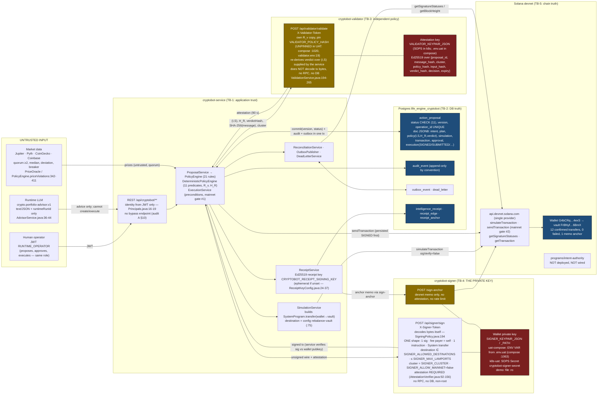
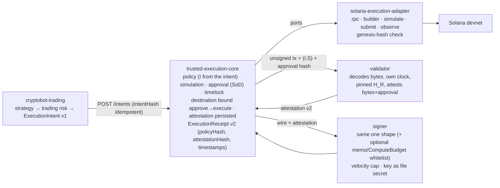

# Trusted Agent Execution — trust boundaries of the actual implementation

Drawn from `life-engine-cryptobot-service` at `2b69b37` and the UAT deployments (uat-compose `deploy/uat/docker-compose.uat.yml`, k8s-uat `gitops/overlays/uat/cryptobot`). This is what runs today, not the target. Every box names the file that proves it. Companion: [`TRUSTED-AGENT-EXECUTION-AUDIT.md`](TRUSTED-AGENT-EXECUTION-AUDIT.md) §6, §8, §9, §14.

## Where trust changes

## Reading the diagram

| Boundary | What is trusted on the far side | What crosses it | Where it is weakest today |
|---|---|---|---|
| **TB-1 application** (`cryptobot-service`) | Nothing from the Internet; the JWT `sub` is the tenant. The service holds the validator and signer tokens, the receipt signing key, the DB credentials and the S2S client secret. | HTTP with JWT; Runtime advice; market prices. | A compromised service can *ask* for signatures of any `transfer(wallet → allow-listed destination, ≤ cap)` and any number of anchor memos; it cannot obtain any other shape. It can fabricate `(I,S)` facts because the validator does not verify them. |
| **TB-2 DB truth** | `action_proposal.status` + `version` is the truth of *what the system decided*; `audit_event` is the causal history; receipts are the *verifiable* copy (signed, content-addressed). | Version-guarded transactions. | `messageHash` and the attestation payload are not stored; audit append-only is not enforced by the DB; receipt key ephemeral if unset. |
| **TB-3 independent policy** (`cryptobot-validator`) | Its own copy of `R_v`; its own key; a hand-inlined predicate table. | `(I,S)` facts, hashes, `cluster` — *declared by the service*. | Does not see the bytes or the chain; `current_slot`/`nonce_unused` are frozen values from proposal time; unpinned in UAT. |
| **TB-4 the private key** (`cryptobot-signer`) | Only the bytes it decodes and the attestation it verifies. Trusts the validator's public key (pinned) and its own config. | Unsigned transaction wire + attestation. | Key delivered as an env var in uat-compose; no genesis-hash check (cluster label declarative); no velocity cap; `sign-anchor` without attestation (devnet fee drain only). |
| **TB-5 chain truth** | Finality of the signature (`confirmed`/`finalized`), block height for expiry. | JSON-RPC to one public provider. | Single RPC; the on-chain authority program is not deployed, so no on-chain policy/nonce enforcement exists. |

## Where the private keys are (today)

| Key | Process | Delivery (uat-compose) | Delivery (k8s-uat) | Delivery (demo) |
|---|---|---|---|---|
| Wallet (devnet) | signer only | **env var** `SIGNER_KEYPAIR_JSON` ← `CRYPTOBOT_DEVNET_WALLET_KEY` in `.env.uat` (0600) | SOPS Secret `cryptobot-signer-secret` → `secretKeyRef` | file `~/.cryptobot-demo/*.json` mounted `:ro` |
| Validator attestation | validator only | env var `VALIDATOR_KEYPAIR_JSON` | SOPS Secret `cryptobot-validator-secret` | file `:ro` |
| Receipt signing | service | `CRYPTOBOT_RECEIPT_SIGNING_KEY` (ephemeral if absent) | idem | idem |
| Vault | nobody (private key discarded by `cryptobot-devnet-credentials.sh`) | pubkey `CRYPTOBOT_REBALANCE_VAULT` | pubkey in `cryptobot.env` | pubkey |
| Tokens (service↔signer, service↔validator, S2S) | service + counterpart | `.env.uat` | SOPS `cryptobot-secret` | `.env.demo` |

No key is in git (audit §6). The LLM never sees a key, a raw RPC payload or transaction bytes (`AdvisorService`).

## Where policy lives (today)

- Service: `cryptobot.policy.*` (21 named rules, thresholds) and `cryptobot.policy.authorization.*` → `PolicyRules` (`R_v`, `H_R`) — `application.yml:200-236`.
- Validator: its own `VALIDATOR_POLICY_*` copy → `H_R'`; refuses to start if `VALIDATOR_POLICY_HASH` is set and differs; UAT does not set it.
- Signer: `SIGNER_ALLOWED_DESTINATIONS`, `SIGNER_MAX_LAMPORTS`, `SIGNER_CLUSTER`, `SIGNER_ALLOW_MAINNET`, `SIGNER_REQUIRE_ATTESTATION` — byte-level policy, independent of `R_v`.
- Chain: none (program not deployed).

## Target (after phases 1–5), same processes

